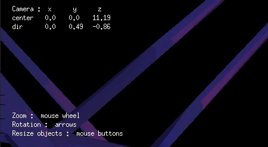
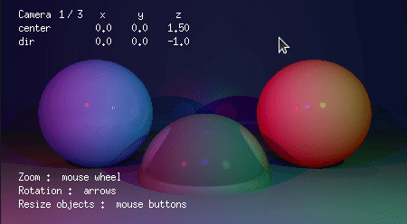
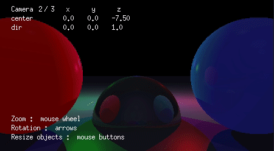
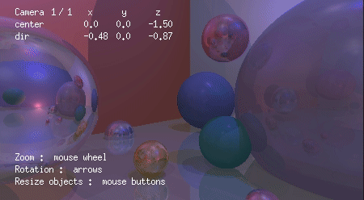
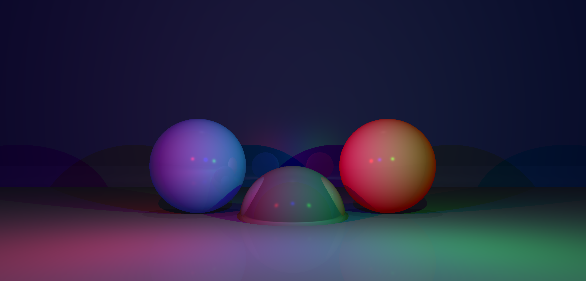
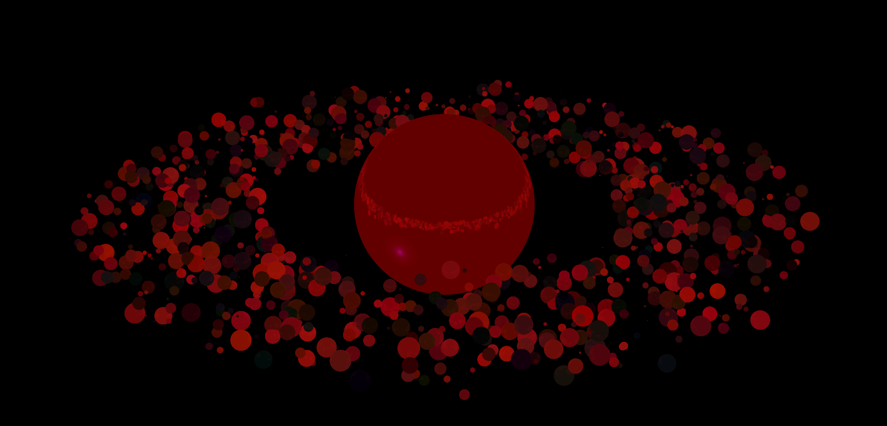

 
# miniRayTracer  
Geometry scene render with miniLibX :pencil2:

Requirements :  
 :small_orange_diamond: MacOS or Linux   
 :small_orange_diamond: GNU make  
 :small_orange_diamond: gcc


## How to run
 Use **make** rule to compile the program. Run it with a scene file.  
 You can find example files in **scenes/** directory.
``` 
cd RayTracer/ && make
``` 
```
./miniRT  [scene.rt]
```
## Useful links
 :small_blue_diamond: [Jamis Buck : The Ray Tracer Challenge](https://pragprog.com/titles/jbtracer/the-ray-tracer-challenge/)  
 :small_blue_diamond: [Habr : Трёхмерная графика с нуля. Часть 1: трассировка лучей](https://habr.com/ru/post/342510/)  
 :small_blue_diamond: Камран Амини : Книга «Экстремальный Cи. Параллелизм, ООП и продвинутые возможности»  

## Features
 
| Zooming | Resizing objects |
|:-----------------------------:|:----------------------------:|
| ||

 Multiple cameras | Rotation |
|:-----------------------------:|:----------------------------:|
| ||

 
 
 

###### Written with C, math and :sparkling_heart:
